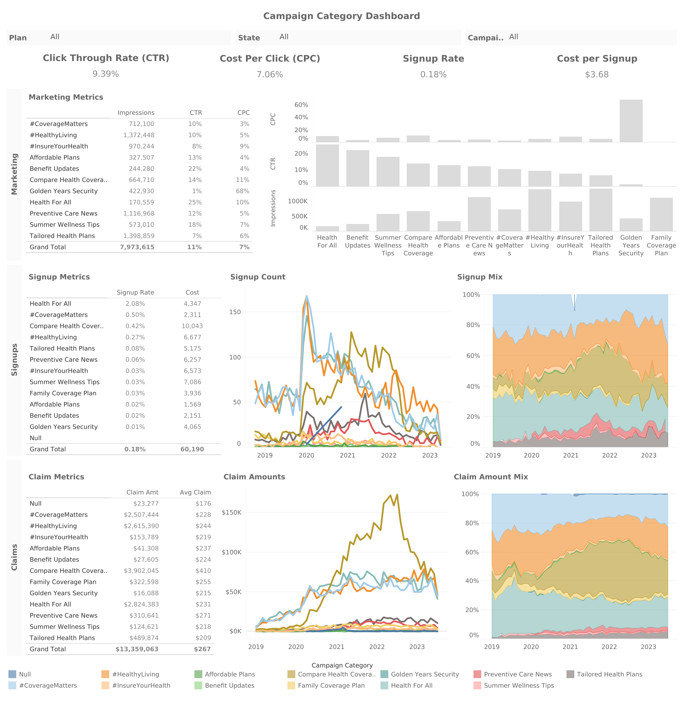

# Row Health Marketing Insights

## Overview
Founded in 2016, Row Health is a medical insurance company serving over thousands of customers throughout the United States. In 2019, they launched a new set of marketing campaign categories spanning topics like wellness tips, the affordability of their plans, and preventative care. Their customers can sign up for 4 different plans - bronze, silver, gold, and platinum - each with different premiums and claim coverage rates.

Row Health is strategizing their marketing budget for the year, and the company would like to build more understanding of the effectiveness of these campaign categories and how they relate to signups and subsequent patient claims.

**The goal of this project is to investigate the performance of marketing campaigns at Row Health in order to surface recommendations on marketing budget allocation across future campaign categories.**

The budget is allocated to drive two primary objectives:  
1. to increase the number of customer signups 
2. to raise awareness of Row Health’s brand across the country.

## Dataset Structure
The dataset consisted of three tables, including information about campaigns, signups and user demographics, as well as claims filed by customers and related claim information.

 

## Insights Summary
**To evaluate campaign performance, we focused on the following key metrics:**
- **Signup Rate:** The percent of people who see a campaign and subsequently sign up for a Row Health plan. <!-- (signups) total signups / total impressions -->
- **Cost per Signup:** The average dollars spent in order to acquire a signup from each campaign. 
  <!-- (cost) total cost / total signups -->
- **Click through Rate:** The percent of people who see a campaign and click on the associated link. 
 <!-- (awareness) total clicks / total impressions -->

<!--
## Industry benchmarks - health insurance campaigns
For healthcare marketing, benchmarks vary, but here's a general overview:

**Industry benchmark - Signup rate:** Conversion rates for search ads average about 3.75%, while for display ads, it's around 0.77%, according to Promodo | Digital Marketing Agency.

**Industry benchmark - Cost per signup:**  The average cost per lead in the health and medical industry is around $78.09, according to Zoe Marketing & Communications. 

**Industry benchmark - Click through rate (CTR):**  Click-through rates (CTR) on search ads average around 3.27%.
-->

<!-- **Low Signup Rate** - From 2019 to 2023, the average signup rate for Row Health were was 0.18% with a total of 16.3K signups. This average was below industry benchmarks of 3.75% for display ads.

**Low Cost per Signup** - The average cost per signup was $3.68, ranging anywhere from $0.65 to $176.73 per campaign. This was average below industry benchmarks of $78.09 for cost per acquisition.

**High Click Through Rate** - The average click-through rate (CTR) was 9.39% across 9.1M impressions. This average was higher than industry benchmarks of 3.27% for CTR. -->

### Signup Rate

- Across all campaign categories, *Health For All* had the highest signup rate at 2.1% and the second highest number of signups at 3.7K. 
- This high signup rate was due to the  *Health Awareness* campaign type, which had by far the highest signup rate across all campaign types (2.8%).
- Interestingly, the campaign category with highest number of signups, *#HealthLiving*, had a relatively low signup rate of 0.3%.

### Click-through Rate
-  *Health For All* <!--(2.7%)--> and *Benefit Updates* categories <!--(2.4%)--> performed nearly 2-3x better than the average CTR at 25% and 22%, respectively. 
- Within the two categories with high CTR, *Product Promotion*-based campaigns had relatively low CTR (0% and 7%).
- *Family Coverage Plan* had high impressions (1.1M) but no clicks - this needs to be investigated and could be due to missing data or issues with the campaign.

### Cost per Signup
- Across campaign categories, *Golden Years Security* had by far the highest cost per signup ($177), as well as the lowest number of signups (23), compared to an average of $3.70.
- Within the two campaign categories with highest cost per signup, info-based campaign types (like *Offer Announcement* and *Policy Information*) drove high costs per signup.
- Some *COVID Awareness* type campaigns also had abnormally high CACs at $1.3K-$2.2K.

<!--
- Golden Years Security had the lowest signup rate at 0.01% and the second lowest CTR at 1.4%. All types within the category performed poorly - with Covid Awareness and Product Promotion types recieving no clicks at all. -->

## Recommendations
Recommendations focus on two strategies: removing ineffective campaign categories and reallocating budget towards categories with better performance across north star metrics:

- **Health for All:** Reallocate budget from *Golden Years Security*, which has high cost per acquisition, to *Health for All* campaigns. *Health for All* outperforms across all key metrics, yet we have invested a relatively low amount ($4.3K) on them.

- **Health Awareness:** Within *Health for All* campaigns, focus on *Health Awareness* type marketing, and less on *Product Promotion* and *Policy Information* type campaigns, which had low signup rates and 0% CTRs.

- **COVID Campaigns:** Investigate the cause of abnormally high cost per signup for *COVID*-based campaigns, which had 1 signup costing $1.3K and another costing $2.2K, compared to an average signup cost of $3.68. Consider removing these campaigns altogether.

- **Compare Health Coverage:** Decrease investment in this campaign category, which has the highest spend ($10K) but mediocre signup rates compared to *Health for All* campaigns.

## Dashboard
The dashboard can be found in Tableau Public [here](https://public.tableau.com/views/RowHealthDashboard_17532371059560/RowHealthDashboard?:language=en-US&:sid=&:redirect=auth&:display_count=n&:origin=viz_share_link). This dashboard enables users to filter by plan, campaign type, and state, and focuses on trends and values in marketing metrics, signup metrics, and claim metrics.

 

## Presentation Sample
The presentation created for the marketing team walks through the insights and recommendations above and can be found [here](https://docs.google.com/presentation/d/1m4gMoKaYX_PznQGGznhev_N1uUBOWX1r/edit?usp=sharing&ouid=106067666576474765486&rtpof=true&sd=true). Some extracts are presented below for easy viewing.

